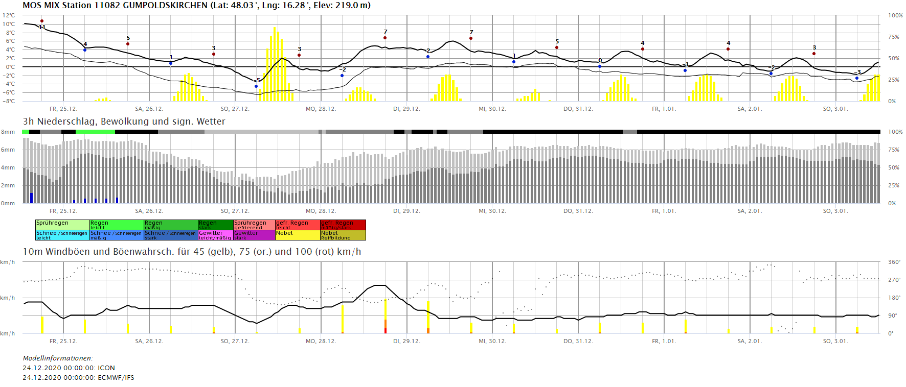
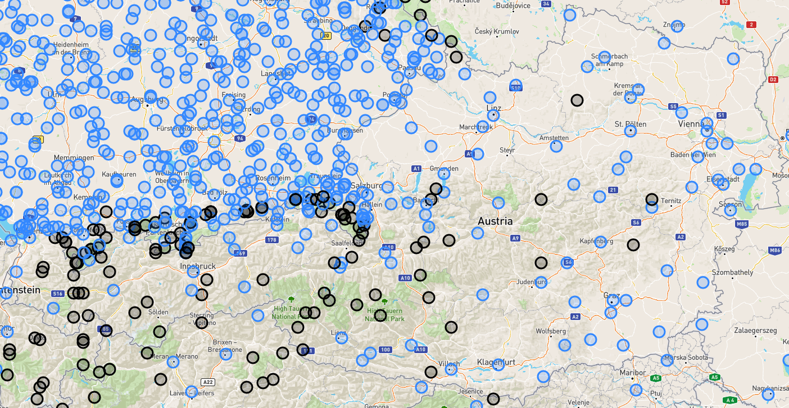

# Client für DWD MOS Mix Daten

Lädt die Stationsvorhersagen für rd. 6000 Stationen von
https://opendata.dwd.de/weather/local_forecasts/mos/MOSMIX_S/all_stations/kml/ und stellt diese
in Diagrammen bereit.

## Starten des Programmes

> Hinweis: Die Applikation benötigt .NET Core 5 als Laufzeitumgebung.

**(1)** Das Background Service prüft nach jeder vollen Stunde minütlich, ob neue Daten vorliegen.
Wurde eine neue Datei bereitgestellt, wird diese geparst und in Binärdateien (1 pro Station) abgelegt,

```text
cd Mosviewer.Service
dotnet run -c Release
```

Das Parsen benötigt rd. 16 Sekunden auf einem Intel Core i7.

**(2)** Die ASP.NET Core Webanwendung hört auf Port 5000 und kann nach dem Starten mit
http://localhost:5000 im Browser aufgerufen werden.

```text
cd Mosviewer.App
dotnet run -c Release
```



